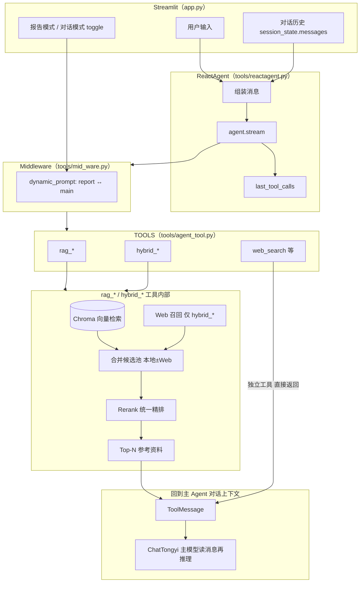
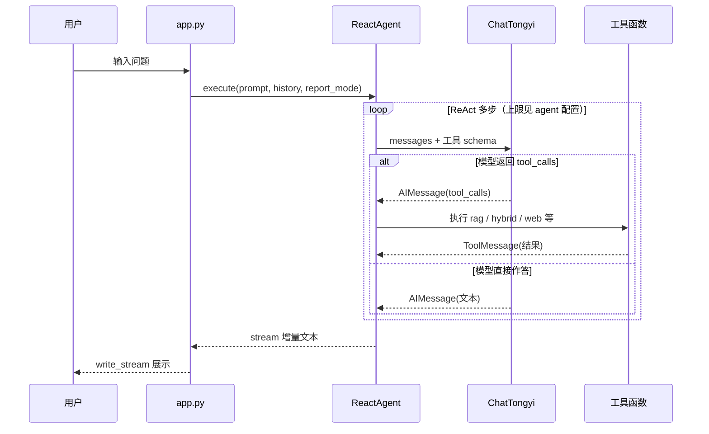

# RAG Agent Demo

基于 **Streamlit** 的对话界面 + **LangChain / LangGraph ReAct Agent**（工具调用）+ **Chroma 向量库** + **通义千问（DashScope）** 的本地知识问答演示项目。支持纯本地 RAG、多路召回（本地 + Web）、Rerank 精排与结构化分块入库。

---

## 技术栈

| 层级 | 选型 |
|------|------|
| 对话 UI | Streamlit（`app.py`） |
| Agent | `create_agent` + 流式 `stream_mode=["values","updates"]`（`tools/reactagent.py`） |
| LLM / Embedding / Rerank | 通义（`ChatTongyi`、`DashScopeEmbeddings`、Rerank API，`model/model.py`） |
| 向量库 | Chroma + 持久化目录（`rag/vector_store.py`） |
| 分块 | 结构化预分段 + `RecursiveCharacterTextSplitter`（`rag/structured_chunking.py`、`config/chrome.yml`） |

---

## 快速开始

1. **Python**：建议 3.10+（已在 3.11 验证）。
2. **安装依赖**：

   ```bash
   pip install -r requirements.txt
   ```

3. **环境变量**：设置 `DASHSCOPE_API_KEY` 或 `TONGYI_API_KEY`（与 `model/model.py` 一致）。可参考仓库内 `ENV.example`。
4. **启动界面**：

   ```bash
   streamlit run app.py
   ```

5. **知识入库**：在侧边栏上传文件到 `data/`，点击「执行入库（向量化）」；未变化的文件会依据 `md5.txt` 跳过。

---

## Agent 完整逻辑链（可视化）

高层上，每一次用户提问都会进入 **ReAct 式循环**：模型根据系统/动态提示词决定是否调用工具 → 执行工具 → 将工具结果写回对话 → 再生成回复，直到结束。流式输出时，前端只展示 **最终助手文本的增量**；工具调用详情可在展开器与日志中查看。

**数据流要点（与你的「合并再 Rerank」一致）**：在 `hybrid_*` 中，**外网/Web 召回**与**向量库检索**得到的片段先进入**同一合并候选池**，再经 **Rerank 统一精排**；精排后的 Top-N 才是后续使用的「参考资料」。这些资料要么经 `*_retrieve` / `hybrid_search` **原样写入 `ToolMessage`**，由 **Agent 主模型（ChatTongyi）** 结合对话组织最终回答；要么在 `*_summarize` 路径下**先在工具内**用同一批精排资料调用 LLM 生成摘要，再把摘要作为工具返回值交给主模型（主模型仍可继续多轮推理）。

### 方框图：从用户输入到模型回答（总览）

建议使用等宽字体查看；对应实现主要在 `app.py`、`tools/reactagent.py`、`tools/mid_ware.py`。

```
┌─────────────────────┐
│      用户输入        │
│  (Streamlit 输入框)  │
└──────────┬──────────┘
           │
           ▼
┌─────────────────────┐
│      app.py         │
│  对话历史 + 报告模式  │
└──────────┬──────────┘
           │
           ▼
┌─────────────────────┐
│     ReactAgent      │
│  历史 → Human/AI    │
│  Message + 本轮问题  │
└──────────┬──────────┘
           │
           ▼
┌─────────────────────┐     ┌─────────────────────┐
│   LangGraph Agent   │     │  Middleware         │
│   create_agent      │◀───▶│  主提示词 ⟷ 报告提示词 │
│   + TOOLS           │     │  (report_mode)      │
└──────────┬──────────┘     └─────────────────────┘
           │
           ▼
┌─────────────────────┐
│    ChatTongyi       │
│  推理 / 是否调工具   │
└──────────┬──────────┘
           │
     ┌─────┴───────────────────────────┐
     ▼                                 ▼
┌─────────────────────┐   ┌─────────────────────────┐
│    直接文本回答      │   │  模型发出 tool_calls     │
│   （未走工具）       │   │  rag / hybrid / web …   │
└──────────┬──────────┘   └────────────┬────────────┘
           │                           │
           │                           ▼
           │               ┌─────────────────────────┐
           │               │ 执行 RAG / Hybrid 工具   │
           │               │  向量库检索 +（Hybrid 时 │
           │               │   Web）→ 合并 → Rerank    │
           │               │ → 参考资料 → ToolMessage │
           │               │   再回到主模型推理       │
           │               └────────────┬────────────┘
           │                           │
           └─────────────┬─────────────┘
                         ▼
     ┌─────────────────────┐
     │  最终 AIMessage 文本  │
     │  ReactAgent 流式增量   │
     └──────────┬──────────┘
              │
              ▼
     ┌─────────────────────┐
     │  write_stream 展示   │
     │  用户看到助手回答     │
     └─────────────────────┘
```

### 方框图：合并 → Rerank → 进入 Agent 上下文（核心数据流）

Hybrid 与「仅本地」的差异只在左侧支路：单路 RAG 无 Web，合并池里只有向量库命中。

```
                        ┌─────────────────────────────────────────┐
                        │      RAG / Hybrid 工具（一次调用）        │
┌──────────┐            │                                         │
│ 用户问题  │───────────│  ┌──────────────┐   ┌──────────────┐   │
└──────────┘            │  │ 向量库 Chroma │   │ Web 召回      │   │
  （tool 入参）          │  │ 向量检索 Top-K│   │ （仅 Hybrid） │   │
                        │  └───────┬──────┘   └──────┬───────┘   │
                        │          └─────────┬───────┘            │
                        │                    ▼                    │
                        │           ┌─────────────────┐           │
                        │           │   合并候选池     │           │
                        │           │ 统一 Document   │           │
                        │           └────────┬────────┘           │
                        │                    ▼                    │
                        │           ┌─────────────────┐           │
                        │           │ Rerank 统一精排  │           │
                        │           │   Top-N 片段    │           │
                        │           └────────┬────────┘           │
                        │                    ▼                    │
                        │           ┌─────────────────┐           │
                        │           │ 格式化为参考资料  │           │
                        │           │ _format_docs …  │           │
                        │           └────────┬────────┘           │
                        └────────────────────┼────────────────────┘
                                             │
              ┌──────────────────────────────┴──────────────────────────────┐
              ▼                                                               ▼
┌─────────────────────────────┐                         ┌─────────────────────────────┐
│ rag_retrieve / hybrid_search │                         │ rag_summarize /             │
│                             │                         │ hybrid_summarize            │
│ 工具返回值 = 精排后参考原文   │                         │ 同上批资料 → 工具内 RAG     │
│ → ToolMessage               │                         │ Prompt + 子 LLM → 摘要字符串 │
│ → Agent 主模型阅读后写最终答 │                         │ → ToolMessage（摘要）        │
│   （ReAct 下一轮）           │                         │ → 主模型可再润色或收束       │
└─────────────────────────────┘                         └─────────────────────────────┘
              │                                                               │
              └───────────────────────────┬───────────────────────────────────┘
                                          ▼
                               ┌─────────────────────┐
                               │ ChatTongyi 主模型    │
                               │ （对话里继续推理）    │
                               └─────────────────────┘
```

### 端到端数据流（Mermaid，可选对照）



说明：`rag_*` 仅有 Chroma 支路进入合并池（「合并池」在此仍表示进入 Rerank 前的统一候选列表）。**`rag_summarize` / `hybrid_summarize`** 在工具内会再用 **子 LLM** 消费 `REF` 生成摘要字符串，该字符串同样以 `ToolMessage` 形式回到主模型；**`rag_retrieve` / `hybrid_search`** 则把精排后的参考原文直接作为 `ToolMessage`，由主模型组织最终回答。

### ReAct 与流式输出（简化）



### 提示词与「报告模式」

- **主对话**：`utils/prompts_hander.get_main_prompt()`  
- **报告模式**（结构化、可沉淀）：`get_report_prompt()`  
- 切换由 `app.py` 的 `report_mode` 传入 `ReactAgent.execute(..., report_mode=True)`，经 `middleware` 里的 `report_prompt_switch` 在 `request.runtime.context["report"]` 上分支。

---

## 工具一览

Agent 将所有工具绑定到 `create_agent`；**具体调用哪几个由模型按问题自主决定**（非硬编码路由）。

| 工具 | 作用 |
|------|------|
| `rag_summarize` | 本地向量库：检索 → Rerank → LLM 总结回答 |
| `rag_retrieve` | 仅检索片段，不调用 LLM 生成 |
| `hybrid_summarize` | 本地 + DuckDuckGo Web → 统一 Rerank → LLM 总结 |
| `hybrid_search` | 同上，仅返回精排后的参考文本 |
| `web_search` | 仅 Web（HTML 接口，演示向） |
| `get_local_datetime` | IANA 时区当前时间 |
| `calculate_arithmetic` | 安全算术（AST，无 `eval`） |
| `get_weather_by_location` / `geocode_place` | Open-Meteo，需外网 |
| `web_search` | 时效性/百科类外网检索 |

工具说明与边界条件见 `tools/agent_tool.py` 内各 `@tool(description=...)`。

---

## RAG 策略

### 单路本地 RAG（`RAGSummarize`）

**方框图**（工具 `rag_summarize` / `rag_retrieve`；仅 **向量库** 一路进入候选池，无 Web）：

```
┌─────────────────────┐
│   用户 query        │
│ (Agent → 工具入参)   │
└──────────┬──────────┘
           │
           ▼
┌─────────────────────┐
│   本地向量库         │
│      (Chroma)       │
│   向量检索 Top-K    │
└──────────┬──────────┘
           │
           ▼
┌─────────────────────┐
│    Rerank 精排       │
│   (qwen3-rerank)    │
│   • 阈值过滤         │
│   • 指令引导         │
│   • 去重            │
└──────────┬──────────┘
           │
           ▼
┌─────────────────────┐
│  Top-N 参考资料      │
│  (_format_docs)     │
└──────────┬──────────┘
           │
     ┌─────┴─────┐
     ▼           ▼
┌─────────┐ ┌─────────────────────┐
│rag_     │ │ rag_summarize       │
│retrieve │ │ 拼 RAG Prompt+子LLM  │
│ToolMsg  │ │ ToolMsg 为摘要       │
│→主模型  │ │ →主模型可继续推理    │
└─────────┘ └─────────────────────┘
```

- **粗排**：`rerank_search_k`（默认 20）条向量候选。  
- **精排**：默认 **增强版 Rerank**（`rag/reranker_enhanced.py`）：分数阈值、`dedup_threshold`、instruct 模式与可选自动 instruct。  
- **链**：LangChain `RunnableLambda` 检索+Rerank → `_format_docs` → `PromptTemplate` → `chat_model`（`rag/ragsummarize.py`）。

### 多路混合 RAG（`HybridRAG`）

**方框图**（工具 `hybrid_summarize` / `hybrid_search`；两路并行召回后合并再精排）：

```
┌─────────────────────┐     ┌─────────────────────┐
│      Web 搜索        │     │     本地向量库        │
│   (DuckDuckGo)      │     │      (Chroma)       │
└──────────┬──────────┘     └──────────┬──────────┘
           │                         │
           │    同一 query 各自召回   │
           └───────────┬─────────────┘
                       ▼
              ┌─────────────────────┐
              │     结果合并池        │
              │  Document 列表统一    │
              │  local / web 打标    │
              └──────────┬──────────┘
                         │
                         ▼
              ┌─────────────────────┐
              │    Rerank 精排       │
              │   (qwen3-rerank)    │
              │   • 阈值过滤         │
              │   • 指令引导         │
              │   • 去重            │
              └──────────┬──────────┘
                         │
                         ▼
              ┌─────────────────────┐
              │  Top-N 格式化        │
              │  = Agent 用参考资料   │
              └──────────┬──────────┘
                         │
         ┌───────────────┴────────────────┐
         ▼                                ▼
┌─────────────────────┐      ┌─────────────────────┐
│  hybrid_search      │      │  hybrid_summarize     │
│ ToolMessage：参考原文 │      │ 参考→工具内 RAG+LLM    │
│ → 主模型写最终回答   │      │ → ToolMessage 为摘要   │
└─────────────────────┘      └─────────────────────┘
         │                                │
         └────────────────┬───────────────┘
                          ▼
                 ┌─────────────────────┐
                 │ Agent 主模型下一轮    │
                 │ （ReAct 消息链路）   │
                 └─────────────────────┘
```

- 本地文档带 `metadata.source_channel = "local"`，Web 解析结果带 `"web"`，便于观察来源。  
- Web 正文由 `web_search` 返回文本再正则解析为 `Document`（`HybridRAG._parse_web_results`）。  
- **注意**：`HybridRAG` 构造时从 `rerank_config` 读取 `hybrid_*` 等键；若要在运行时完全同步 `config/rag.yml` 中的混合检索段落，需保证这些键已并入 `utils/config_hander.py` 中的 `rerank_config`（或构造 `HybridRAG` 时显式传参）。未并入时仍可使用代码内默认值（与当前 yaml 示例一致：Web 5、本地 15、Rerank Top-5）。

### Rerank 配置要点（`config/rag.yml`）

| 配置项 | 含义 |
|--------|------|
| `rerank_model` | 如 `qwen3-rerank` |
| `rerank_top_n` | 单路 RAG 精排保留条数 |
| `rerank_search_k` | 向量粗排条数（应大于 top_n） |
| `rerank_enhanced` | 是否增强版 Rerank |
| `rerank_score_threshold` | 分数阈值（单路与混合路在代码里默认阈值可能不同，见 `RAGSummarize` / `HybridRAG`） |
| `rerank_dedup_threshold` | 去重相似度阈值 |
| `rerank_instruct_mode` / `rerank_auto_instruct` | 指令模式与自动选择 |

---

## Chunk（分块）策略

入库路径：`VectorStoreService.load_data()`（`rag/vector_store.py`）。

**方框图**（知识入库流水线）：

```
┌─────────────────────┐
│  data/ 下知识文件    │
│ txt pdf docx …      │
└──────────┬──────────┘
           │  MD5 未入库则继续
           ▼
┌─────────────────────┐
│   按后缀选择 Loader  │
└──────────┬──────────┘
           │
           ▼
┌─────────────────────┐
│  结构化预分段（可选） │
│  标题/章节 → section │
└──────────┬──────────┘
           │
           ▼
┌─────────────────────┐
│ RecursiveCharacter  │
│ TextSplitter 切块    │
└──────────┬──────────┘
           │
           ▼
┌─────────────────────┐
│ 【章节】前缀（可选）  │
└──────────┬──────────┘
           │
           ▼
┌─────────────────────┐
│ Chroma.add_documents │
│ 写入向量库          │
└─────────────────────┘
```

**结构化预分段**（`rag/structured_chunking.py`）识别：

- Markdown 标题：`#`～`######`  
- 中文独立行：`第…章/节/篇`  
- 序号标题：`1.`、`一、` 等形式（含行长度上限，降低正文误匹配）

每个子段写入 `metadata.section`（若有），最终 chunk 可选 **`【章节】…` 前缀**，增强向量与 Rerank 对章节语义的感知。

**递归切分参数**（`config/chrome.yml`）：

- `chunk_size` / `chunk_overlap`：默认 512 / 80。  
- `separators`：多级分隔符回退，优先段落与中文句读，最后字符级切分。  
- **增量入库**：同内容 MD5 已在 `md5_path` 则跳过，避免重复向量化。

---

## 配置与日志

| 文件 | 内容 |
|------|------|
| `config/rag.yml` | 对话模型、embedding、Rerank、混合检索（文档说明） |
| `config/chrome.yml` | Chroma 路径、集合名、`k`、分块、结构化分块开关 |
| `config/agent.yml` | Agent 迭代上限等（`max_iterations` 等） |
| `config/prompts.yml` | 提示词片段（经 `utils/prompts_hander` 加载） |
| `log/agent.log` | 模型与工具调用轨迹（与 `ReactAgent` 中 `log_tool_calls` 配合） |

---

## 仓库结构（核心）

```
agent/
├── app.py                 # Streamlit 入口
├── tools/
│   ├── reactagent.py      # ReAct Agent + 流式
│   ├── agent_tool.py      # 全部 @tool 定义
│   └── mid_ware.py        # 日志 + 报告/主提示词切换
├── rag/
│   ├── vector_store.py    # Chroma 入库与检索服务
│   ├── structured_chunking.py
│   ├── ragsummarize.py    # RAGSummarize + HybridRAG
│   ├── reranker.py
│   └── reranker_enhanced.py
├── model/model.py         # ChatTongyi + DashScopeEmbeddings
├── config/                # YAML 配置
├── data/                  # 知识文件目录（实际数据不入库）
├── db/chroma/             # 向量持久化（本地生成）
└── tests/                 # 单元/对比测试
```

---

## 测试

```bash
pytest tests/ -q
```

含结构化分块、混合检索等用例（见 `tests/`）。

---

## 说明与限制

- **Web 搜索**：DuckDuckGo HTML 非官方接口，适合演示；生产请换官方 API 并注意合规与频控。  
- **天气 / 地理**：依赖外网 Open-Meteo。  
- **Embedding 未就绪**：未装 `dashscope` / `langchain-community` 或未配置 API Key 时，向量服务会报错；勿让 Chroma 在无自定义 embedding 时默默回落到外网下载默认模型（见 `vector_store.py` 中说明）。

---


